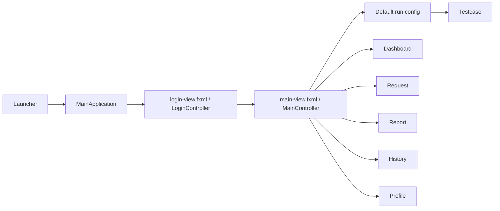
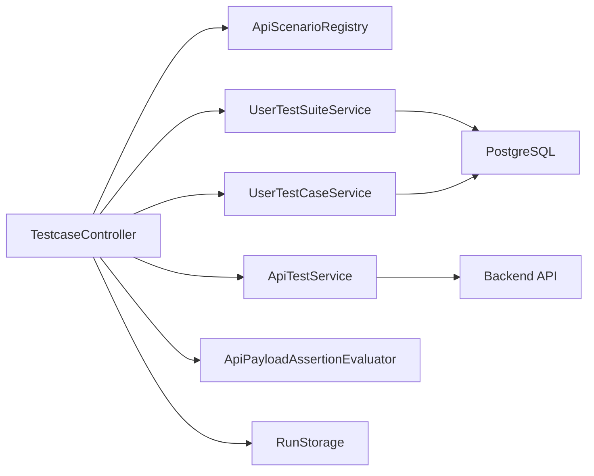
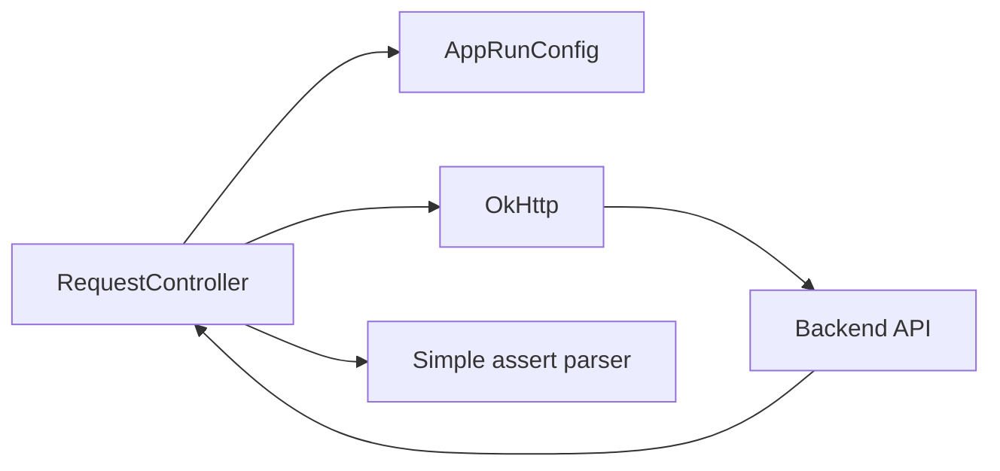

# Kien truc

## 1. Tong the

Ung dung theo mo hinh JavaFX desktop:

- FXML views trong `src/main/resources`
- controllers xu ly UI state va event
- services orchestration, test execution, JSON parsing va storage
- repositories truy cap PostgreSQL
- models bieu dien user, testcase, suite va ket qua run
- config giu session/runtime state

## 2. Package layout

```text
src/main/java/com/example/apitestapp
|-- Launcher.java
|-- MainApplication.java
|-- MainController.java
|-- config/
|-- controllers/
|-- db/
|-- models/
|-- repository/
`-- services/
    |-- auth/
    |-- flow/
    |-- map/
    |-- realapitest/
    `-- user/
```

Resource UI:

```text
src/main/resources/com/example/apitestapp
|-- login-view.fxml
|-- main-view.fxml
|-- views/
|   |-- dashboard-view.fxml
|   |-- testcase-view.fxml
|   |-- request-view.fxml
|   |-- report-view.fxml
|   |-- history-view.fxml
|   |-- profile-view.fxml
|   |-- collections-view.fxml
|   `-- environments-view.fxml
`-- styles/
```

## 3. Khoi dong va navigation



`MainController`:

- cache view trong `viewCache`
- goi `RefreshableView.refresh()` khi mo lai view
- wire callback `openReportForRun` cho Dashboard va History
- dang ky phim tat
- hien confirm dialog khi dong app
- reset session/config khi logout

## 4. Luong chay testcase



Trinh tu chinh:

1. User chon scenario code hoac user suite/case.
2. Controller tao `TestCaseRowModel`.
3. Khi run, controller resolve base URL va endpoint.
4. Path params duoc replace vao URL.
5. Query params duoc append vao URL.
6. Headers duoc apply vao request.
7. Setup requests duoc chay truoc request chinh.
8. Response variables duoc capture theo `jsonPath`.
9. Auth setup mac dinh co the duoc kich hoat neu can runtime token.
10. Request chinh goi qua `ApiTestService`.
11. Status, payload assertions va expected body duoc danh gia.
12. Cleanup requests duoc chay.
13. `TestRun` va `TestResult` duoc luu vao `RunStorage`.

## 5. Request builder flow



Request builder:

- resolve URL tuyet doi hoac relative
- parse query string vao bang params va dong bo nguoc lai URL
- add custom headers
- set `Authorization` cho Basic/Bearer
- gui raw body hoac multipart form-data
- format JSON response o muc text
- parse assert script don gian

## 6. Model chinh

### Config/session

- `AppSession`
- `AppRunConfig`
- `SelectedRunContext`

### Test execution

- `ApiScenarioDefinition`
- `ApiTestScenario`
- `ApiSetupRequest`
- `ApiCleanupRequest`
- `ApiResponseVariable`
- `ApiPayloadAssertion`
- `ApiPayloadAssertionEvaluator`
- `ApiResponse`
- `ApiTestService`

### User-defined tests

- `UserTestSuite`
- `UserTestCase`
- `UserTestSuiteService`
- `UserTestCaseService`

### Result storage

- `TestRun`
- `TestResult`
- `RunStorage`

## 7. Persistence

### PostgreSQL

Repository:

- `UserRepository`
- `RoleRepository`
- `ClientMachineRepository`
- `UserTestSuiteRepository`
- `UserTestCaseRepository`

Bang chinh:

- `roles`
- `users`
- `client_machines`
- `user_test_suites`
- `user_test_cases`

### File JSON local

`RunStorage` ghi lich su run vao:

```text
%LOCALAPPDATA%\api-test-app\runs.json
```

Fallback:

```text
%USERPROFILE%\.api-test-app\runs.json
```

## 8. Scenario architecture

`ApiScenarioProvider` tra ve `ApiScenarioDefinition`:

- `collectionName`
- `moduleName`
- `apiLabel`
- `endpoint`
- `sampleRequestBody`
- `scenarios`
- `cleanupRequests`

`ApiScenarioRegistry` tap hop provider tu cac package:

- `services.auth`
- `services.user`
- `services.map`
- `services.flow`
- `services.realapitest`

## 9. Diem ky thuat can can than

- `TestcaseController` gom nhieu workflow trong mot class, blast radius cao.
- `database.sql` chua phai migration sach.
- Ten collection/module/apiLabel chua dong nhat giua provider.
- `Request` form-data chua co file upload.
- `Profile`, `Collections`, `Environments` chua phai module nghiep vu hoan chinh.
