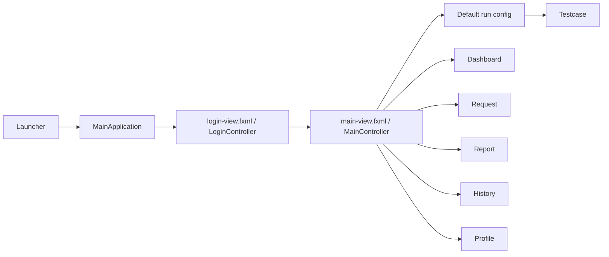
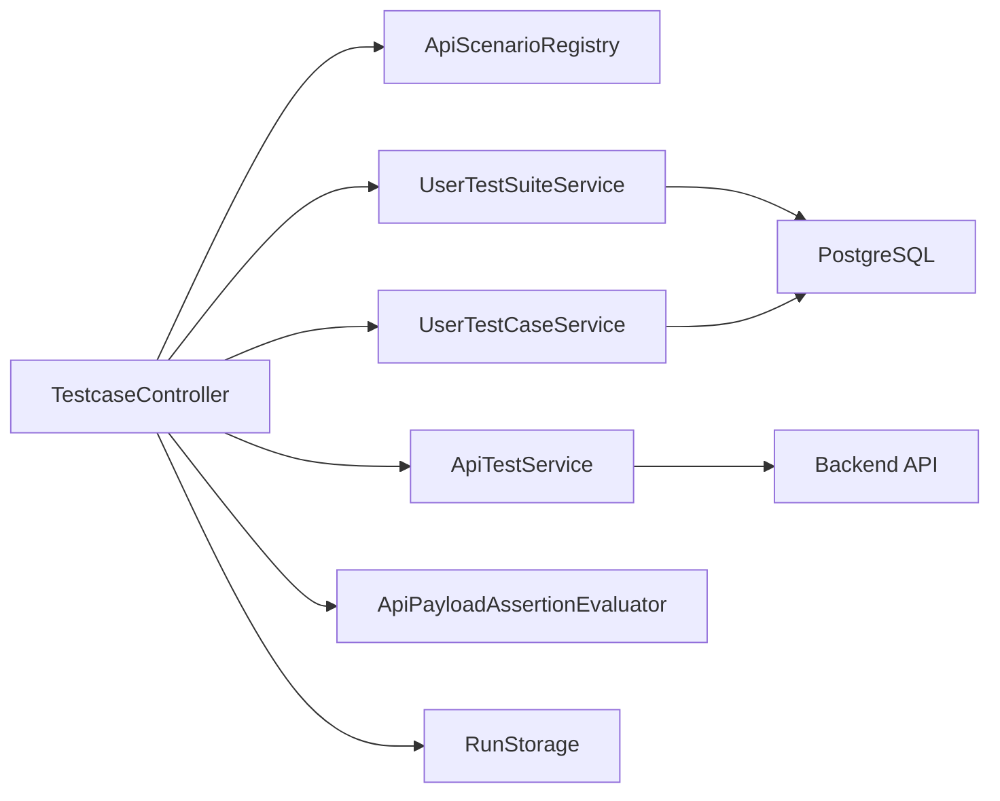
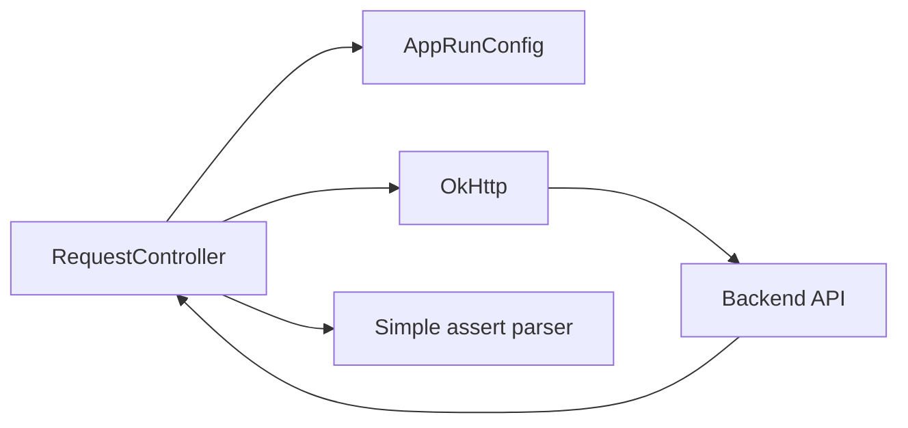

# Kiến trúc

## 1. Tổng thể

Ứng dụng theo mô hình JavaFX desktop:

- FXML views trong `src/main/resources`
- controllers xử lý trạng thái UI và sự kiện
- services điều phối, thực thi kiểm thử, phân tích JSON và lưu trữ
- repositories truy cập PostgreSQL
- models biểu diễn người dùng, testcase, suite và kết quả chạy
- config giữ trạng thái session/runtime

## 2. Package layout

```text
src/main/java/com/example/apitestapp
|-- Launcher.java
|-- MainApplication.java
|-- MainController.java
|-- config/
|-- controllers/
|-- db/
|-- models/
|-- repository/
`-- services/
    |-- auth/
    |-- flow/
    |-- map/
    |-- realapitest/
    `-- user/
```

Resource UI:

```text
src/main/resources/com/example/apitestapp
|-- login-view.fxml
|-- main-view.fxml
|-- views/
|   |-- dashboard-view.fxml
|   |-- testcase-view.fxml
|   |-- request-view.fxml
|   |-- report-view.fxml
|   |-- history-view.fxml
|   |-- profile-view.fxml
|   |-- collections-view.fxml
|   `-- environments-view.fxml
`-- styles/
```

## 3. Khởi động và điều hướng



`MainController`:

- cache view trong `viewCache`
- gọi `RefreshableView.refresh()` khi mở lại view
- kết nối callback `openReportForRun` cho Dashboard và History
- đăng ký phím tắt
- hiển thị hộp thoại xác nhận khi đóng ứng dụng
- reset session/config khi đăng xuất

## 4. Luồng chạy testcase



Trình tự chính:

1. Người dùng chọn scenario có sẵn hoặc user suite/case.
2. Controller tạo `TestCaseRowModel`.
3. Khi chạy, controller ghép base URL và endpoint.
4. Path params được thay thế vào URL.
5. Query params được nối vào URL.
6. Headers được áp dụng vào request.
7. Setup requests được chạy trước request chính.
8. Response variables được trích xuất theo `jsonPath`.
9. Auth setup mặc định có thể được kích hoạt nếu cần runtime token.
10. Request chính được gọi qua `ApiTestService`.
11. Status, payload assertions và expected body được đánh giá.
12. Cleanup requests được chạy.
13. `TestRun` và `TestResult` được lưu vào `RunStorage`.

## 5. Request builder flow



Request builder:

- xử lý URL tuyệt đối hoặc tương đối
- phân tích query string vào bảng params và đồng bộ ngược lại URL
- add custom headers
- set `Authorization` cho Basic/Bearer
- gửi raw body hoặc multipart form-data
- định dạng JSON response ở mức văn bản
- phân tích assert script đơn giản

## 6. Model chính

### Config/session

- `AppSession`
- `AppRunConfig`
- `SelectedRunContext`

### Test execution

- `ApiScenarioDefinition`
- `ApiTestScenario`
- `ApiSetupRequest`
- `ApiCleanupRequest`
- `ApiResponseVariable`
- `ApiPayloadAssertion`
- `ApiPayloadAssertionEvaluator`
- `ApiResponse`
- `ApiTestService`

### User-defined tests

- `UserTestSuite`
- `UserTestCase`
- `UserTestSuiteService`
- `UserTestCaseService`

### Result storage

- `TestRun`
- `TestResult`
- `RunStorage`

## 7. Persistence

### PostgreSQL

Repository:

- `UserRepository`
- `RoleRepository`
- `ClientMachineRepository`
- `UserTestSuiteRepository`
- `UserTestCaseRepository`

Bảng chính:

- `roles`
- `users`
- `client_machines`
- `user_test_suites`
- `user_test_cases`

### File JSON local

`RunStorage` ghi lịch sử chạy vào:

```text
%LOCALAPPDATA%\api-test-app\runs.json
```

Đường dẫn dự phòng:

```text
%USERPROFILE%\.api-test-app\runs.json
```

## 8. Scenario architecture

`ApiScenarioProvider` trả về `ApiScenarioDefinition`:

- `collectionName`
- `moduleName`
- `apiLabel`
- `endpoint`
- `sampleRequestBody`
- `scenarios`
- `cleanupRequests`

`ApiScenarioRegistry` tập hợp provider từ các package:

- `services.auth`
- `services.user`
- `services.map`
- `services.flow`
- `services.realapitest`

## 9. Điểm kỹ thuật cần cẩn thận

- `TestcaseController` gom nhiều workflow trong một class, blast radius cao.
- `setup.sql` là script khởi tạo cơ sở dữ liệu mới; `database.sql` chỉ được giữ làm tài liệu tham khảo cũ.
- Tên collection/module/apiLabel chưa đồng nhất giữa các provider.
- `Request` form-data chưa có chức năng tải file lên.
- `Profile`, `Collections`, `Environments` chưa phải module nghiệp vụ hoàn chỉnh.
