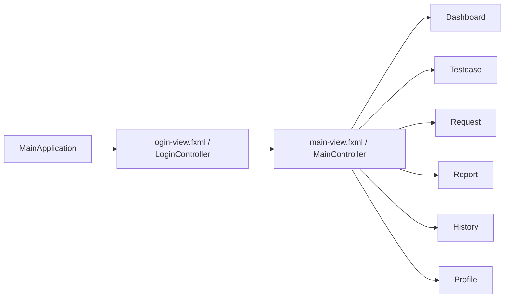
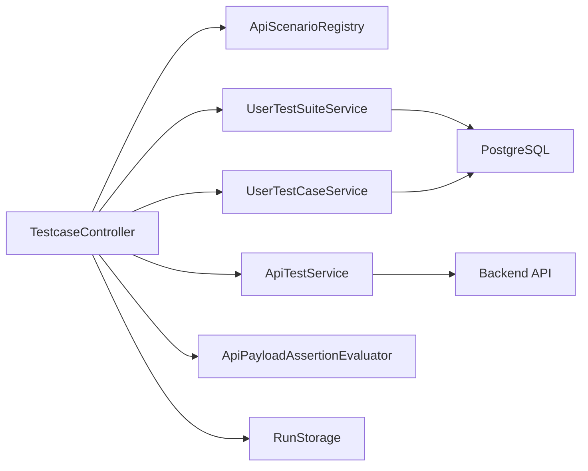

# Kien truc

## 1. Tong the

Ung dung theo mo hinh JavaFX desktop:

- `views` (`.fxml`) cho giao dien
- `controllers` cho event/UI state
- `services` cho orchestration, test execution, storage
- `repository` cho PostgreSQL
- `models` cho object nghiep vu
- `config` cho session va runtime state

## 2. Package layout

```text
src/main/java/com/example/apitestapp
|-- MainApplication.java
|-- MainController.java
|-- config/
|-- controllers/
|-- db/
|-- models/
|-- repository/
`-- services/
```

Resource UI:

```text
src/main/resources/com/example/apitestapp
|-- login-view.fxml
|-- main-view.fxml
|-- views/
|   |-- dashboard-view.fxml
|   |-- testcase-view.fxml
|   |-- request-view.fxml
|   |-- report-view.fxml
|   |-- history-view.fxml
|   |-- profile-view.fxml
|   |-- collections-view.fxml
|   `-- environments-view.fxml
`-- styles/
```

## 3. Luong khoi dong va dieu huong



`MainController` co 3 vai tro ky thuat quan trong:

- cache cac view da nap trong `viewCache`
- noi callback mo report tu `Dashboard` va `History`
- dang ky phim tat va dialog xac nhan thoat

## 4. Luong chay testcase



Trinh tu nghiep vu:

1. chon scenario hoac user suite
2. nap `ApiTestScenario` / `UserTestCase`
3. build `TestCaseRowModel`
4. khi run:
   - resolve URL
   - replace path params
   - them query params
   - chay setup requests
   - capture response variables
   - auth setup neu can
   - goi request chinh
   - so sanh status code
   - so sanh payload/full response
   - cleanup
5. luu `TestRun` + `TestResult`

## 5. Model chinh

### Runtime / session

- `AppSession`
- `AppRunConfig`
- `SelectedRunContext`

### Ket qua run

- `TestRun`
- `TestResult`
- `RunStorage`

### Testcase

- `ApiScenarioDefinition`
- `ApiTestScenario`
- `ApiSetupRequest`
- `ApiCleanupRequest`
- `ApiPayloadAssertion`
- `TestCaseRowModel`
- `UserTestSuite`
- `UserTestCase`

## 6. Persistence

### PostgreSQL

Repository hien co:

- `UserRepository`
- `RoleRepository`
- `ClientMachineRepository`
- `UserTestSuiteRepository`
- `UserTestCaseRepository`

`UserTestCaseRepository` hien da doc/ghi duoc cac field nang cao nhu:

- `query_params`
- `path_params`
- `payload_assertions`
- `expected_response_body`

### File JSON local

`RunStorage` luu lich su run vao `%LOCALAPPDATA%\\api-test-app\\runs.json`.

Ly do:

- khong buoc phai luu run vao database
- giam rui ro xung dot file trong workspace

## 7. Scenario architecture

`ApiScenarioRegistry` tao danh sach provider co san theo code. Nhom provider dang thay ro:

- `auth`
- `user`
- `map`
- `flow`
- `real API`

Moi provider tra ve `ApiScenarioDefinition` gom:

- `collectionName`
- `moduleName`
- `apiLabel`
- `endpoint`
- `sampleRequestBody`
- `scenarios`
- `cleanupRequests`

## 8. Diem ky thuat dang mo

- ten module/collection chua dong nhat
- `RequestController` chua su dung auth UI trong HTTP request
- `Collections` va `Environments` chua noi vao luong chinh
- `database.sql` chua du dieu kien de xem la migration sach
- `TestcaseController` rat lon, blast radius cao khi sua
