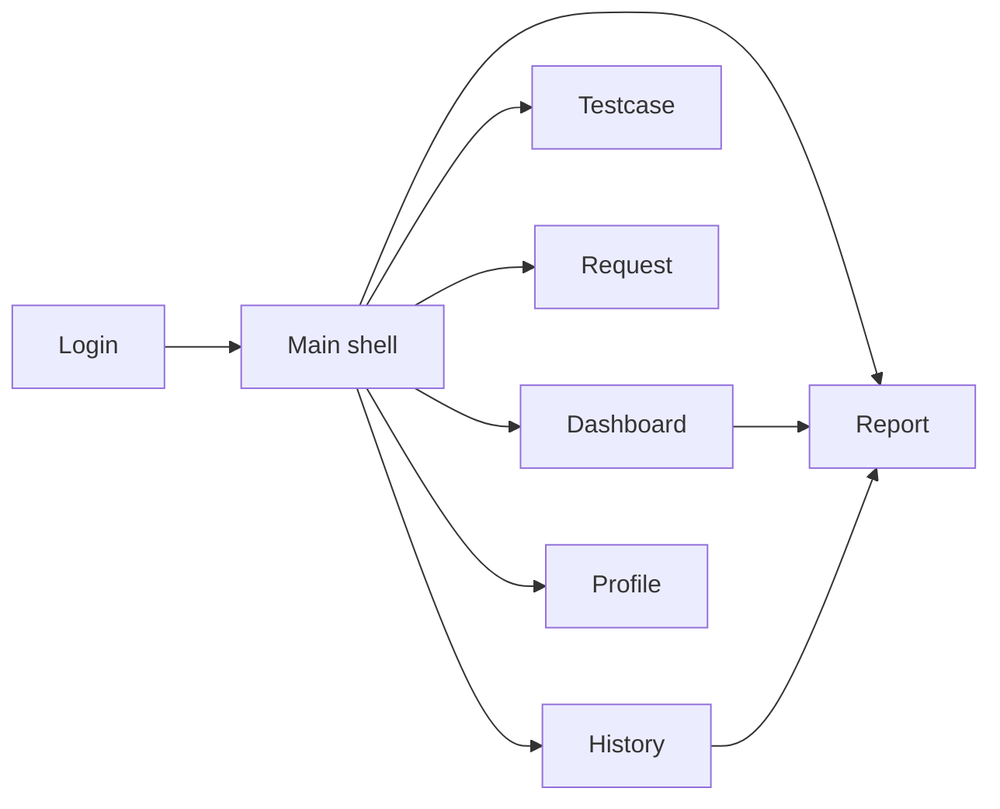

# Ma tran man hinh

Tai lieu nay tong hop cac man hinh dang ton tai trong repo va trang thai ket noi cua chung trong ung dung.

## 1. Man hinh trong luong chinh

| Man hinh | FXML | Controller | Cach mo | Trang thai |
|---|---|---|---|---|
| Login | `login-view.fxml` | `LoginController` | mo khi app start | hoat dong |
| Main shell | `main-view.fxml` | `MainController` | sau khi login | hoat dong |
| Dashboard | `views/dashboard-view.fxml` | `DashboardController` | menu, `Ctrl + D` | hoat dong |
| Testcase | `views/testcase-view.fxml` | `TestcaseController` | menu, `Ctrl + T` | hoat dong |
| Request | `views/request-view.fxml` | `RequestController` | menu, `Ctrl + R` | hoat dong |
| Report | `views/report-view.fxml` | `ReportController` | menu, `Ctrl + E`, tu Dashboard/History | hoat dong |
| History | `views/history-view.fxml` | `HistoryController` | menu, `Ctrl + H` | hoat dong |
| Profile | `views/profile-view.fxml` | `ProfileController` | user menu | hoat dong mot phan |

## 2. Man hinh ton tai nhung chua noi vao navigation chinh

| Man hinh | FXML | Controller | Trang thai |
|---|---|---|---|
| Collections | `views/collections-view.fxml` | `CollectionsController` | scaffold / chua noi vao menu |
| Environments | `views/environments-view.fxml` | `EnvironmentsController` | scaffold / chua noi vao menu |

## 3. Nhan xet tung man hinh

### Login

- xac thuc user bang `UserRepository`
- sau khi login thanh cong se vao main shell

### Dashboard

- tong hop KPI va run gan day
- double-click vao run de mo report

### Testcase

- la man hinh co nghiep vu lon nhat
- nap scenario code va user testcase
- CRUD suite/testcase
- run test, setup, cleanup, payload assertion, luu ket qua

### Request

- dung de goi API thu cong
- auth UI da co
- auth request thuc te chua duoc ap vao HTTP call

### Report

- xem ket qua chi tiet cua 1 run
- duoc mo truc tiep tu Dashboard hoac History

### History

- loc, tim, xoa run
- double-click hoac nut xem de mo report

### Profile

- hien thi thong tin user hien tai
- hien tai nghien ve read-only / UI-level

### Collections

- controller hien gan nhu chi la khung khoi tao
- chua thay nghiep vu ro rang trong luong chinh

### Environments

- co UI chon moi truong
- nhung cau hinh moi truong nay chua duoc noi vao `AppRunConfig` hoac navigation chinh

## 4. Luong dieu huong tong quat

## 5. Ghi chu

- `MainController` cache view da nap de tai su dung lai.
- Cac view implement `RefreshableView` se duoc goi `refresh()` khi mo lai.
- `Collections` va `Environments` nen duoc coi la tai nguyen UI ton tai trong repo, khong nen coi la tinh nang da hoan tat.
