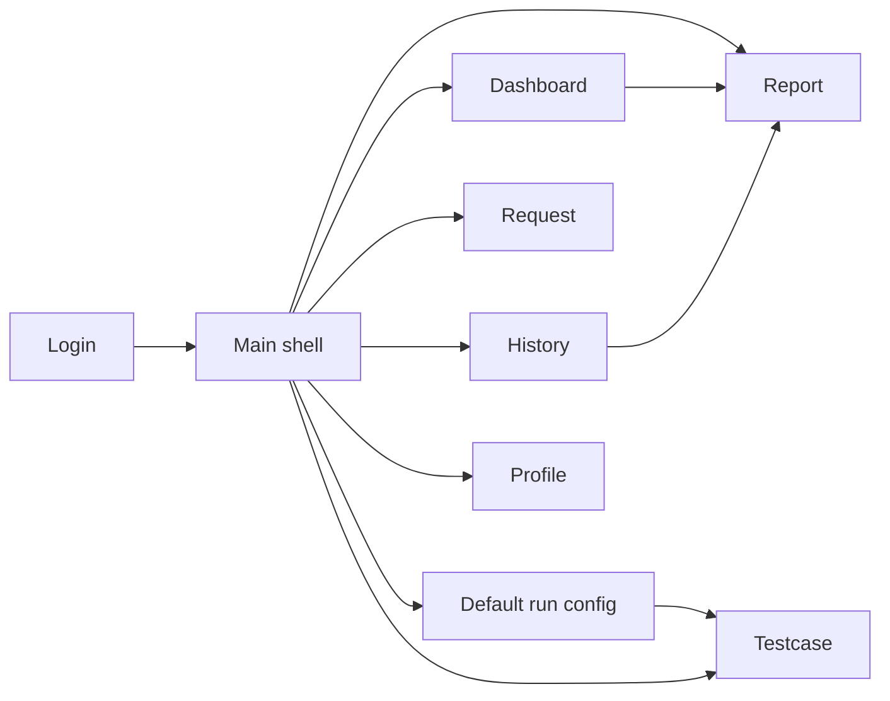

# Ma trận màn hình

Tài liệu này liệt kê các màn hình trong repo và trạng thái kết nối với điều hướng chính.

## 1. Màn hình trong luồng chính

| Màn hình   | FXML                        | Controller            | Cách mở                                       | Trạng thái         |
|------------|-----------------------------|-----------------------|----------------------------------------------|--------------------|
| Login      | `login-view.fxml`           | `LoginController`     | khởi động ứng dụng                            | hoạt động          |
| Main shell | `main-view.fxml`            | `MainController`      | sau khi đăng nhập                             | hoạt động          |
| Dashboard  | `views/dashboard-view.fxml` | `DashboardController` | menu, `Ctrl + D`                              | hoạt động          |
| Testcase   | `views/testcase-view.fxml`  | `TestcaseController`  | menu, `Ctrl + T`, sau khi lưu default config | hoạt động          |
| Request    | `views/request-view.fxml`   | `RequestController`   | menu, `Ctrl + R`                              | hoạt động          |
| Report     | `views/report-view.fxml`    | `ReportController`    | menu, `Ctrl + E`, Dashboard/History           | hoạt động          |
| History    | `views/history-view.fxml`   | `HistoryController`   | menu, `Ctrl + H`                              | hoạt động          |
| Profile    | `views/profile-view.fxml`   | `ProfileController`   | user menu                                     | hoạt động một phần |

## 2. Màn hình tồn tại nhưng chưa nối vào điều hướng chính

| Màn hình     | FXML                           | Controller               | Trạng thái                             |
|--------------|--------------------------------|--------------------------|----------------------------------------|
| Collections  | `views/collections-view.fxml`  | `CollectionsController`  | scaffold / chưa có menu chính          |
| Environments | `views/environments-view.fxml` | `EnvironmentsController` | scaffold / chưa nối với `AppRunConfig` |

## 3. Nhận xét từng màn hình

### Login

- nhập email/password
- có nút hiện/ẩn password
- xác thực qua `UserRepository`
- đăng nhập thành công sẽ khởi tạo `AppSession` và mở main shell

### Main shell

- cache view theo FXML path
- gọi `refresh()` nếu controller triển khai `RefreshableView`
- nối callback mở report từ Dashboard/History
- lưu thông tin client machine sau khi đăng nhập
- hiển thị hộp thoại default run config

### Dashboard

- tổng hợp KPI từ `RunStorage`
- hiển thị các lần chạy gần đây
- nhấp đúp vào run để mở report

### Testcase

- nạp scenario có sẵn và user suite/case
- CRUD user suite/case
- run all, run selected, stop
- setup, cleanup, path params, query params, headers, assertions
- lưu run vào `RunStorage`

### Request

- debug endpoint thủ công
- method, URL, params, headers
- raw body và multipart form-data
- Basic Auth và Bearer Token được áp dụng vào header `Authorization`
- hiển thị response body/headers/time và kết quả test script đơn giản

### Report

- xem một run đã chọn trong `SelectedRunContext`
- hiển thị summary, charts và bảng chi tiết
- có thể mở từ menu, Dashboard hoặc History

### History

- lọc theo ngày, status và keyword
- mở report
- xóa run khỏi `RunStorage`

### Profile

- hiển thị thông tin user hiện tại
- chưa phải module sửa profile đầy đủ

### Collections

- resource UI/controller có trong repo
- chưa có workflow rõ ràng trong điều hướng chính

### Environments

- resource UI/controller có trong repo
- chưa nối vào cấu hình runtime base URL của ứng dụng

## 4. Luồng điều hướng

