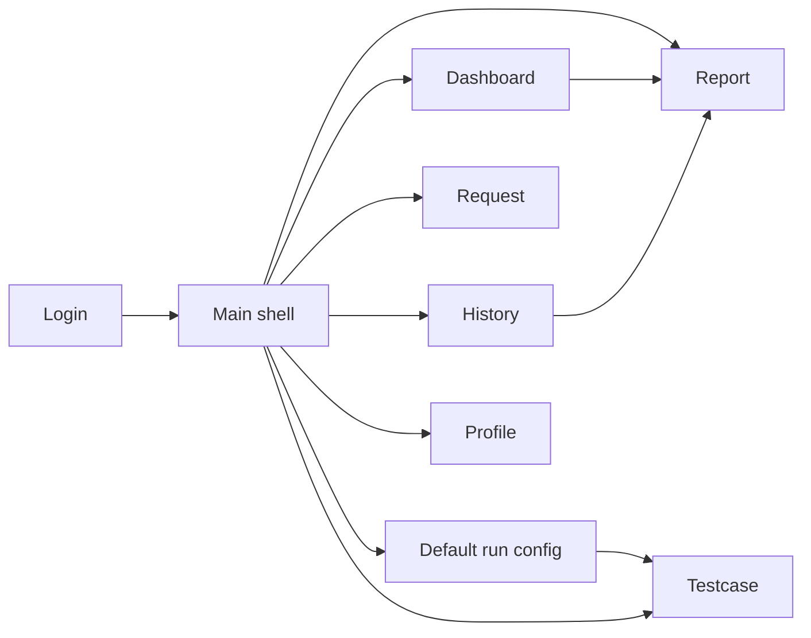

# Ma tran man hinh

Tai lieu nay liet ke cac man hinh trong repo va trang thai ket noi voi navigation chinh.

## 1. Man hinh trong luong chinh

| Man hinh   | FXML                        | Controller            | Cach mo                                      | Trang thai         |
|------------|-----------------------------|-----------------------|----------------------------------------------|--------------------|
| Login      | `login-view.fxml`           | `LoginController`     | app start                                    | hoat dong          |
| Main shell | `main-view.fxml`            | `MainController`      | sau login                                    | hoat dong          |
| Dashboard  | `views/dashboard-view.fxml` | `DashboardController` | menu, `Ctrl + D`                             | hoat dong          |
| Testcase   | `views/testcase-view.fxml`  | `TestcaseController`  | menu, `Ctrl + T`, sau khi luu default config | hoat dong          |
| Request    | `views/request-view.fxml`   | `RequestController`   | menu, `Ctrl + R`                             | hoat dong          |
| Report     | `views/report-view.fxml`    | `ReportController`    | menu, `Ctrl + E`, Dashboard/History          | hoat dong          |
| History    | `views/history-view.fxml`   | `HistoryController`   | menu, `Ctrl + H`                             | hoat dong          |
| Profile    | `views/profile-view.fxml`   | `ProfileController`   | user menu                                    | hoat dong mot phan |

## 2. Man hinh ton tai nhung chua noi vao navigation chinh

| Man hinh     | FXML                           | Controller               | Trang thai                             |
|--------------|--------------------------------|--------------------------|----------------------------------------|
| Collections  | `views/collections-view.fxml`  | `CollectionsController`  | scaffold / chua co menu chinh          |
| Environments | `views/environments-view.fxml` | `EnvironmentsController` | scaffold / chua noi voi `AppRunConfig` |

## 3. Nhan xet tung man hinh

### Login

- nhap email/password
- co nut hien/an password
- xac thuc qua `UserRepository`
- login thanh cong se khoi tao `AppSession` va mo main shell

### Main shell

- cache view theo FXML path
- goi `refresh()` neu controller implement `RefreshableView`
- noi callback mo report tu Dashboard/History
- luu thong tin client machine sau login
- hien dialog default run config

### Dashboard

- tong hop KPI tu `RunStorage`
- hien run gan day
- double-click run de mo report

### Testcase

- nap scenario co san va user suite/case
- CRUD user suite/case
- run all, run selected, stop
- setup, cleanup, path params, query params, headers, assertions
- luu run vao `RunStorage`

### Request

- debug endpoint thu cong
- method, URL, params, headers
- raw body va multipart form-data
- Basic Auth va Bearer Token duoc ap vao header `Authorization`
- hien response body/headers/time va ket qua test script don gian

### Report

- xem mot run da chon trong `SelectedRunContext`
- hien summary, charts va bang chi tiet
- co the mo tu menu, Dashboard hoac History

### History

- loc theo ngay, status va keyword
- mo report
- xoa run khoi `RunStorage`

### Profile

- hien thong tin user hien tai
- chua phai module sua profile day du

### Collections

- resource UI/controller co trong repo
- chua co workflow ro trong navigation chinh

### Environments

- resource UI/controller co trong repo
- chua noi vao cau hinh runtime base URL cua app

## 4. Luong dieu huong

