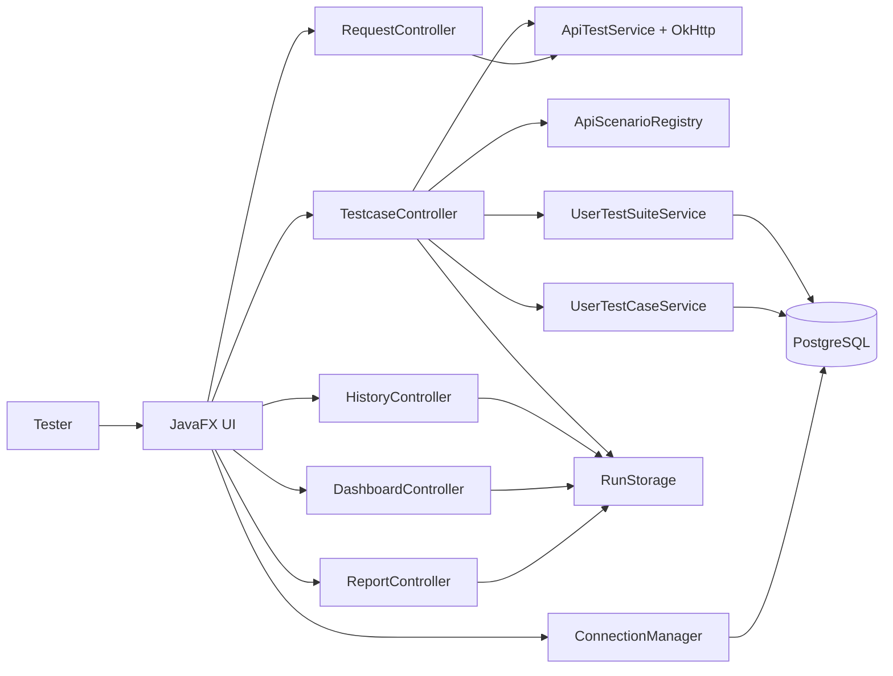
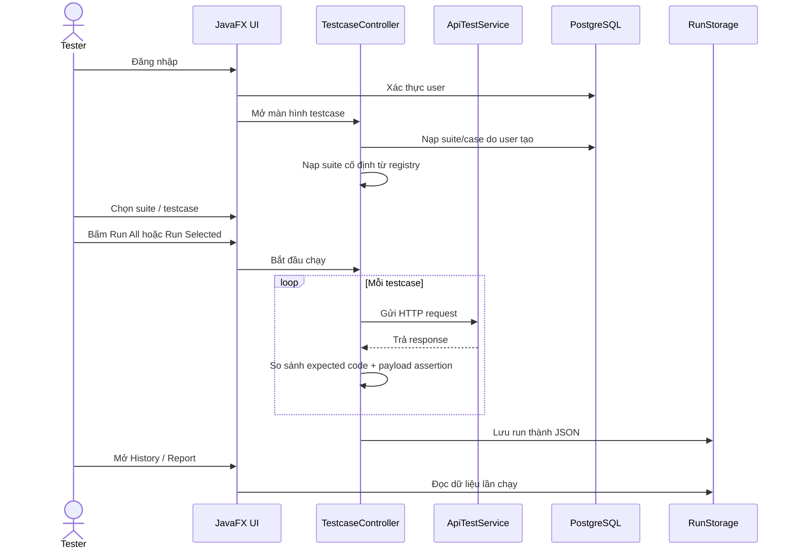
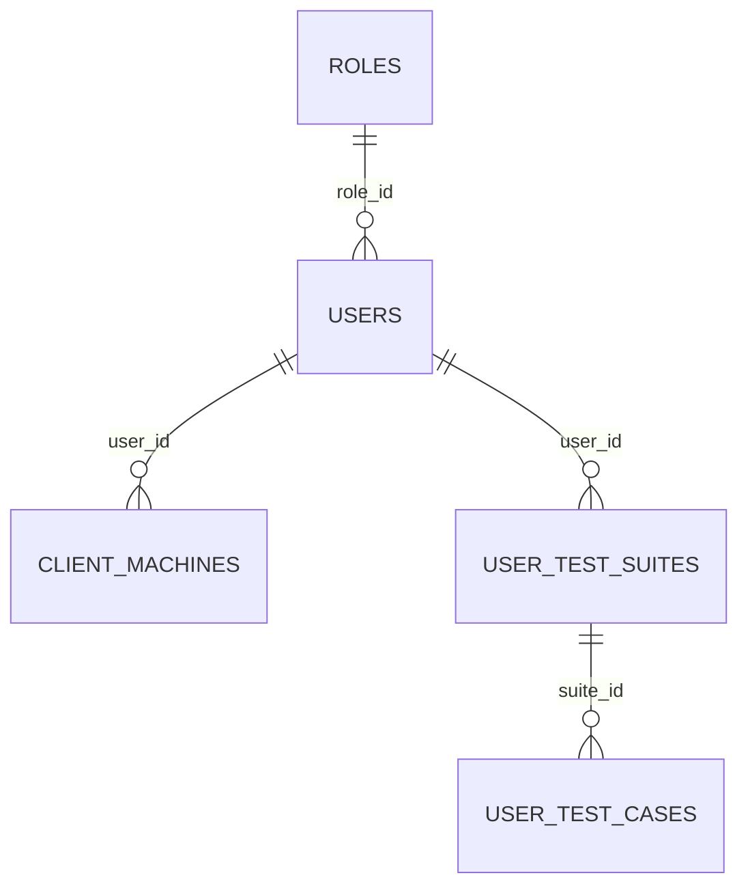

# Tài Liệu Hệ Thống API Test App

Tài liệu này mô tả ứng dụng kiểm thử REST API cho hệ thống dẫn đường trong bệnh viện. Đối tượng sử dụng chính là tester.

## Mục Tiêu Ứng Dụng

Ứng dụng cung cấp một môi trường JavaFX để:

- Quản lý các `testsuite` cố định do hệ thống nạp sẵn.
- Thêm, sửa, xóa `testsuite` và `testcase` do người dùng tạo.
- Chạy kiểm thử API theo từng testcase hoặc cả suite.
- Ghi nhận lịch sử chạy test và hiển thị báo cáo.
- Hỗ trợ setup/cleanup data, truyền biến runtime, và kiểm tra payload.

## Phạm Vi Chức Năng

### Nhóm tính năng chính

- Đăng nhập người dùng.
- Màn hình dashboard tổng quan.
- Màn hình quản lý testcase.
- Màn hình gửi request thủ công.
- Màn hình xem lịch sử chạy.
- Màn hình báo cáo chi tiết.
- Màn hình profile.
- Màn hình environments.

### Dữ liệu test

- Test suite cố định được khai báo trong code qua các `ScenarioProvider`.
- Test suite do người dùng tạo được lưu trong PostgreSQL.
- Test case do người dùng tạo được lưu trong PostgreSQL.
- Lịch sử chạy test được lưu cục bộ bằng file JSON thông qua `RunStorage`.

## Công Nghệ

Theo `pom.xml` và `module-info.java`, ứng dụng dùng:

- Java 21
- JavaFX 21.0.6
- AtlantisFX 2.1.0
- OkHttp 5.3.2
- PostgreSQL JDBC 42.7.10
- Gson 2.10.1
- Lombok 1.18.46
- JUnit 5.12.1

## Kiến Trúc Tổng Quan



## Các Thành Phần Chính

### 1. `MainApplication` và `MainController`

- Khởi động ứng dụng và nạp màn hình chính.
- Điều hướng giữa các view trong ứng dụng.
- Hiển thị hộp thoại cấu hình chạy mặc định khi vào màn hình chính.
- Lấy thông tin máy trạm hiện tại và lưu vào bảng `client_machines`.

### 2. `LoginController`

- Đăng nhập bằng email và mật khẩu.
- Xác thực dữ liệu qua `UserRepository`.
- Cập nhật session người dùng qua `AppSession`.

### 3. `TestcaseController`

Đây là màn hình trung tâm của ứng dụng. Nó chịu trách nhiệm:

- Nạp cây `Collections` gồm các test suite cố định và suite do user tạo.
- Hiển thị danh sách testcase tương ứng.
- Chạy test tuần tự.
- Dừng khi gặp fail nếu người dùng chọn chế độ này.
- Thêm/sửa/xóa suite và testcase do user tạo.
- Cấu hình setup/cleanup requests.
- Lưu kết quả chạy vào `RunStorage`.

### 4. `RequestController`

- Gửi request API thủ công.
- Hỗ trợ chọn method, nhập URL, body và xem phản hồi.
- Hiển thị status code, thời gian phản hồi và headers trả về.

### 5. `HistoryController`

- Đọc lịch sử chạy từ `RunStorage`.
- Lọc theo thời gian, trạng thái và từ khóa.
- Cho phép mở báo cáo chi tiết của một lần chạy.
- Cho phép xóa một lần chạy khỏi lịch sử cục bộ.

### 6. `ReportController`

- Hiển thị báo cáo chi tiết cho một lần chạy.
- Hiển thị tổng số case, số pass/fail, pie chart và bar chart.
- Hiển thị bảng kết quả từng testcase.

### 7. `DashboardController`

- Tổng hợp số lượng testcase đã chạy, pass, fail.
- Hiển thị 8 lần chạy gần nhất.
- Từ dashboard có thể mở nhanh báo cáo.

### 8. `ProfileController` và `EnvironmentsController`

- `ProfileController` hiển thị thông tin người dùng.
- `EnvironmentsController` quản lý lựa chọn môi trường hiển thị trên sidebar.

## Luồng Sử Dụng Chính



## Quản Lý Test Suite Và Test Case

### Test suite cố định

Các suite cố định được khai báo trong `ApiScenarioRegistry` và các `ScenarioProvider`. Dữ liệu này được nạp từ code, không phụ thuộc vào database.

Nhóm API hiện có gồm:

- Auth: signup, login, change password, get user info.
- User: set user info.
- Map: các API liên quan đến bản đồ, node, step, edges, floor, meta.

### Test suite do user tạo

Người dùng có thể:

- Thêm testsuite mới.
- Sửa testsuite đã tạo.
- Xóa testsuite đã tạo.
- Gắn cleanup requests cho testsuite.

Test suite do user tạo được lưu trong bảng `user_test_suites`.

### Test case do user tạo

Người dùng có thể:

- Thêm testcase mới.
- Sửa testcase.
- Xóa testcase.

Test case do user tạo được lưu trong bảng `user_test_cases`. Mỗi testcase có thể chứa:

- Headers
- Query params
- Request body
- Setup requests
- Cleanup requests
- Expected status code

## Cơ Chế Chạy Test

### `ApiTestService`

`ApiTestService` dùng OkHttp để gửi request thực tế tới hệ thống đích.

Đặc điểm:

- Hỗ trợ GET, POST, PUT, PATCH, DELETE.
- Hỗ trợ headers.
- Hỗ trợ query params.
- Timeout mặc định 10 giây cho connect/read/write.
- Trả về `ApiResponse` gồm HTTP code, body, message và trạng thái thành công/thất bại.

### Setup và cleanup

Khi chạy testcase, ứng dụng có thể:

- Chạy setup requests trước testcase chính.
- Trích xuất biến từ response setup bằng JSON path.
- Thay thế biến runtime trong body/header/query params bằng cú pháp `${ten_bien}`.
- Chạy cleanup requests sau khi hoàn tất lượt chạy.

### Kiểm tra kết quả

Testcase được đánh giá theo hai lớp:

- So sánh expected code với response code thực tế.
- Kiểm tra payload assertions nếu scenario có khai báo.

### Chế độ dừng

Ứng dụng hỗ trợ 2 kiểu xử lý khi có lỗi:

- Chạy tiếp đến hết.
- Dừng ngay khi gặp fail.

## Lưu Trữ Lịch Sử

Lịch sử chạy test không lưu trực tiếp vào PostgreSQL. Nó được lưu bằng `RunStorage` vào file JSON cục bộ để tránh lỗi khóa file trên thư mục đồng bộ.

Vị trí file:

- Windows: `%LOCALAPPDATA%\api-test-app\runs.json`
- Fallback khác: `~/.api-test-app/runs.json`

Mỗi lần chạy được lưu cùng:

- ID lần chạy
- Tên run
- User thực thi
- Máy trạm
- Hệ điều hành
- Tổng số case
- Số pass/fail
- Danh sách kết quả từng testcase

## Cấu Hình Ứng Dụng

### Cấu hình base URL và chế độ chạy

`AppRunConfig` giữ các cấu hình runtime:

- `baseUrl`
- `runMode`
- `alertMode`
- `runner`

Giá trị mặc định:

- `baseUrl`: `http://localhost:8080`
- `runMode`: `ALL`
- `alertMode`: `Stop on fail`

### Cấu hình database

`ConnectionManager` đọc cấu hình theo thứ tự ưu tiên:

1. System property
2. Environment variable
3. Giá trị mặc định trong code

Các key hỗ trợ:

- URL: `app.db.url` hoặc `APP_DB_URL`
- User: `app.db.user` hoặc `APP_DB_USER`
- Password: `app.db.password` hoặc `APP_DB_PASSWORD`

Giá trị mặc định trong code:

- URL: `jdbc:postgresql://localhost:5432/api_test_app`
- User: `postgres`
- Password: `12345`

## Cài Đặt Và Chạy Ứng Dụng

### Yêu cầu

- Java 21
- Maven 3.9+
- PostgreSQL 15+ hoặc tương thích
- Quyền tạo database và import schema

### Chuẩn bị database

1. Tạo database tên `api_test_app`.
2. Chạy file schema: `src/main/resources/db/database.sql`.
3. Kiểm tra lại user/password DB nếu khác mặc định.

### Chạy bằng Maven

```bash
mvn clean test
mvn javafx:run
```

### Chạy với tham số DB tùy chỉnh

```bash
mvn -Dapp.db.url=jdbc:postgresql://localhost:5432/api_test_app ^
    -Dapp.db.user=postgres ^
    -Dapp.db.password=12345 javafx:run
```

Trên Windows PowerShell, có thể set biến môi trường trước khi chạy:

```powershell
$env:APP_DB_URL="jdbc:postgresql://localhost:5432/api_test_app"
$env:APP_DB_USER="postgres"
$env:APP_DB_PASSWORD="12345"
mvn javafx:run
```

## Cấu Trúc Database

File `src/main/resources/db/database.sql` hiện chỉ còn phần schema phục vụ cho ứng dụng đang dùng:

### Nhóm người dùng và máy trạm

- `roles`: vai trò người dùng.
- `users`: tài khoản đăng nhập.
- `client_machines`: máy trạm của người dùng.

### Nhóm test do user tạo

- `user_test_suites`: testsuite động do user tạo.
- `user_test_cases`: testcase động do user tạo.

### Ý nghĩa phạm vi hiện tại

- Phần schema cho `collections`, `folders`, `test_suits`, `api_endpoints`, `test_cases`, `test_data_sets`, `test_runs`, `test_results`, `test_assertions`, `test_reports` đã không còn trong file `database.sql` hiện tại.
- Nếu cần phục hồi các bảng này, phải bổ sung lại migration/schema tương ứng trước khi cập nhật tài liệu.

## Mô Hình Quan Hệ Rút Gọn



## Quy Ước Dữ Liệu Test Case

### Test case cố định

- Được định nghĩa trong code.
- Có thể đi kèm setup requests.
- Có thể đi kèm payload assertions.
- Có thể đi kèm cleanup requests.

### Test case động

- Được người dùng nhập trong UI.
- Lưu vào PostgreSQL.
- Cho phép dùng lại trong các lần chạy sau.

### Biến runtime

Ứng dụng hỗ trợ placeholder dạng:

- `${ten_bien}`

Các biến này có thể được lấy từ response của setup request và thay vào request body, headers hoặc query params của testcase chính.

## Hướng Dẫn Sử Dụng Nhanh

1. Đăng nhập bằng tài khoản tester.
2. Vào màn `Testcase`.
3. Chọn suite cố định hoặc suite do user tạo.
4. Chỉnh base URL nếu cần.
5. Chọn `Run All` hoặc `Run Selected`.
6. Xem log, dashboard, history và report sau khi chạy xong.

## Xử Lý Sự Cố Thường Gặp

### Không kết nối được database

- Kiểm tra PostgreSQL đang chạy.
- Kiểm tra database `api_test_app` đã tồn tại.
- Kiểm tra `ConnectionManager` hoặc biến môi trường cấu hình DB.

### Không thấy dữ liệu testsuite do user tạo

- Kiểm tra user đã đăng nhập đúng tài khoản chưa.
- Kiểm tra bảng `user_test_suites` và `user_test_cases` có dữ liệu.
- Kiểm tra repository/service có lỗi truy vấn SQL không.

### Run xong nhưng history trống

- Kiểm tra `RunStorage` có ghi được file JSON không.
- Kiểm tra quyền ghi vào `%LOCALAPPDATA%` hoặc thư mục `~/.api-test-app`.

### Test fail dù API trả về đúng HTTP code

- Kiểm tra payload assertions.
- Kiểm tra các biến runtime đã được thay thế hết chưa.
- Kiểm tra cleanup/setup request có thành công không.

## Ghi Chú Kỹ Thuật

- `TestcaseController` đang chạy test trên một luồng nền để tránh khóa giao diện.
- `HistoryController` và `DashboardController` đọc dữ liệu từ cùng `RunStorage`.
- `ReportController` hiển thị run được chọn gần nhất hoặc run đã chọn trong lịch sử.
- `MainController` xóa cache view khi logout để đảm bảo user sau nạp lại màn hình sạch.

## Tài Liệu Liên Quan

- `README.md`
- `pom.xml`
- `src/main/resources/db/database.sql`
- `src/main/java/com/example/apitestapp/db/ConnectionManager.java`
- `src/main/java/com/example/apitestapp/controllers/TestcaseController.java`
- `src/main/java/com/example/apitestapp/services/RunStorage.java`
