# Use case phan ra

Tai lieu nay phan ra use case tong quat thanh cac nhom use case theo module nghiep vu cua `API Test App`.

## 1. Nguyen tac phan ra

- Phan ra theo man hinh va luong nghiep vu hien co trong code.
- Chi giu cac use case co dau hieu ro trong controller/service hien tai.
- Khong dua cac use case quan tri he thong chua thay ro trong repo.

## 2. So do use case phan ra

```mermaid
flowchart TB
    tester["Tester"]
    backend["Backend API"]
    db["PostgreSQL"]
    storage["RunStorage JSON"]

    subgraph auth["Module Auth"]
        uc1["Dang nhap"]
        uc2["Khoi tao session"]
    end

    subgraph config["Module Cau hinh run"]
        uc3["Nhap Base URL"]
        uc4["Chon Alert mode"]
        uc5["Nhap Runner"]
        uc6["Luu runtime config"]
    end

    subgraph testcase["Module Testcase"]
        uc7["Xem collections / scenario"]
        uc8["Nap testcase co san"]
        uc9["Nap user test suite"]
        uc10["Nap user test case"]
        uc11["Tao user test suite"]
        uc12["Sua user test suite"]
        uc13["Xoa user test suite"]
        uc14["Tao user test case"]
        uc15["Sua user test case"]
        uc16["Xoa user test case"]
        uc17["Chay Run All"]
        uc18["Chay Run Selected"]
        uc19["Dung qua trinh run"]
        uc20["Thuc thi setup request"]
        uc21["Capture response variable"]
        uc22["Thuc thi request chinh"]
        uc23["Thuc thi cleanup request"]
        uc24["Luu ket qua run"]
    end

    subgraph request["Module Request"]
        uc25["Nhap method va URL"]
        uc26["Nhap raw body"]
        uc27["Gui request thu cong"]
        uc28["Xem response body / headers / time"]
    end

    subgraph dashboard["Module Dashboard"]
        uc29["Xem thong ke tong quan"]
        uc30["Xem run gan day"]
        uc31["Mo report tu dashboard"]
    end

    subgraph report["Module Report"]
        uc32["Xem tong hop ket qua run"]
        uc33["Xem chi tiet tung testcase"]
        uc34["Xem bieu do pass/fail va response time"]
    end

    subgraph history["Module History"]
        uc35["Loc lich su run"]
        uc36["Tim kiem lich su"]
        uc37["Mo report tu history"]
        uc38["Xoa run da luu"]
    end

    subgraph profile["Module Profile"]
        uc39["Xem thong tin profile"]
    end

    tester --> uc1
    tester --> uc3
    tester --> uc4
    tester --> uc5
    tester --> uc7
    tester --> uc11
    tester --> uc12
    tester --> uc13
    tester --> uc14
    tester --> uc15
    tester --> uc16
    tester --> uc17
    tester --> uc18
    tester --> uc19
    tester --> uc25
    tester --> uc26
    tester --> uc27
    tester --> uc29
    tester --> uc31
    tester --> uc32
    tester --> uc35
    tester --> uc36
    tester --> uc37
    tester --> uc38
    tester --> uc39

    uc1 --> uc2
    uc1 --> db
    uc3 --> uc6
    uc4 --> uc6
    uc5 --> uc6
    uc9 --> db
    uc10 --> db
    uc11 --> db
    uc12 --> db
    uc13 --> db
    uc14 --> db
    uc15 --> db
    uc16 --> db
    uc17 --> uc20
    uc17 --> uc21
    uc17 --> uc22
    uc17 --> uc23
    uc17 --> uc24
    uc18 --> uc20
    uc18 --> uc21
    uc18 --> uc22
    uc18 --> uc23
    uc18 --> uc24
    uc20 --> backend
    uc22 --> backend
    uc23 --> backend
    uc24 --> storage
    uc27 --> backend
    uc31 --> storage
    uc32 --> storage
    uc35 --> storage
    uc37 --> storage
    uc38 --> storage
```

## 3. Cay phan ra use case

### 3.1 Auth

- `Dang nhap`
  - kiem tra tai khoan
  - khoi tao `AppSession`
  - chuyen sang main view

### 3.2 Cau hinh run

- `Cau hinh run mac dinh`
  - nhap `Base URL`
  - chon `Alert mode`
  - nhap `Runner`
  - luu vao `AppRunConfig`

### 3.3 Testcase

- `Nap nguon testcase`
  - nap scenario co san tu `ApiScenarioRegistry`
  - nap user test suite tu database
  - nap user test case tu database

- `Quan ly user test suite`
  - tao
  - sua
  - xoa

- `Quan ly user test case`
  - tao
  - sua
  - xoa

- `Chay testcase`
  - chon `Run All` hoac `Run Selected`
  - setup du lieu
  - capture bien runtime
  - goi request chinh
  - cleanup
  - luu ket qua run

### 3.4 Request

- `Goi request thu cong`
  - nhap method
  - nhap URL
  - nhap body
  - xem response

### 3.5 Dashboard

- `Xem dashboard`
  - xem KPI tong quan
  - xem danh sach run gan day
  - mo report

### 3.6 Report

- `Xem report`
  - xem tong hop pass/fail
  - xem bang ket qua
  - xem bieu do

### 3.7 History

- `Quan ly lich su run`
  - loc theo ngay
  - loc theo status
  - tim theo keyword
  - mo report
  - xoa run

### 3.8 Profile

- `Xem profile`
  - xem ten hien thi
  - xem email
  - xem so dien thoai
  - xem thong tin role/UI profile

## 4. Quan he voi tai lieu khac

- Tong quan actor va use case muc cao: [USECASE_TONG_QUAT.md](/D:/code/api-test-app/docs/USECASE_TONG_QUAT.md)
- Mo ta he thong tong the: [TAI_LIEU_HE_THONG.md](/D:/code/api-test-app/docs/TAI_LIEU_HE_THONG.md)
- Luong ky thuat va package: [ARCHITECTURE.md](/D:/code/api-test-app/docs/ARCHITECTURE.md)

## 5. Ghi chu

- So do nay la phan ra nghiep vu, khong phai sequence diagram.
- `Admin` chua duoc tach actor rieng vi repo chua the hien ro use case quan tri doc lap.
- `Environments` va `Collections` chua duoc dua thanh module use case rieng vi code hien tai chua co hanh vi nghiep vu day du.
