# Use case phan ra

Tai lieu nay phan ra use case theo module trong code hien tai.

## 1. Nguyen tac

- Phan ra theo man hinh va service dang ton tai.
- Khong them use case ma repo chua co dau hieu ro.
- Ghi nhan gioi han cua scaffold UI thay vi coi la tinh nang hoan tat.

## 2. So do phan ra

```mermaid
flowchart TB
    tester["Tester"]
    backend["Backend API"]
    db["PostgreSQL"]
    storage["RunStorage JSON"]

    subgraph auth["Auth"]
        uc1["Nhap email/password"]
        uc2["Kiem tra user"]
        uc3["Khoi tao session"]
        uc4["Luu client machine"]
    end

    subgraph config["Run config"]
        uc5["Nhap Base URL"]
        uc6["Chon Alert mode"]
        uc7["Luu AppRunConfig"]
    end

    subgraph testcase["Testcase"]
        uc8["Nap scenario co san"]
        uc9["Nap user suite"]
        uc10["Nap user case"]
        uc11["Tao/sua/xoa suite"]
        uc12["Tao/sua/xoa case"]
        uc13["Khai bao params/body/assertions"]
        uc14["Run All"]
        uc15["Run Selected"]
        uc16["Stop run"]
        uc17["Setup va capture variables"]
        uc18["Resolve URL/params/headers"]
        uc19["Goi request chinh"]
        uc20["Assert status/payload/body"]
        uc21["Cleanup"]
        uc22["Luu run"]
    end

    subgraph request["Request"]
        uc23["Nhap method/URL"]
        uc24["Dong bo query params"]
        uc25["Nhap headers"]
        uc26["Chon auth"]
        uc27["Nhap raw body"]
        uc28["Nhap form-data"]
        uc29["Gui request"]
        uc30["Xem response"]
        uc31["Chay test script"]
    end

    subgraph observe["Observe"]
        uc32["Xem dashboard"]
        uc33["Mo report"]
        uc34["Xem chart/bang ket qua"]
        uc35["Loc history"]
        uc36["Xoa run"]
    end

    subgraph profile["Profile"]
        uc37["Xem profile"]
        uc38["Logout"]
    end

    tester --> uc1
    tester --> uc5
    tester --> uc8
    tester --> uc11
    tester --> uc12
    tester --> uc14
    tester --> uc15
    tester --> uc23
    tester --> uc29
    tester --> uc32
    tester --> uc33
    tester --> uc35
    tester --> uc37
    tester --> uc38

    uc2 --> db
    uc4 --> db
    uc9 --> db
    uc10 --> db
    uc11 --> db
    uc12 --> db
    uc17 --> backend
    uc19 --> backend
    uc21 --> backend
    uc22 --> storage
    uc29 --> backend
    uc32 --> storage
    uc33 --> storage
    uc35 --> storage
    uc36 --> storage
```

## 3. Cay use case

### 3.1 Auth

- `Dang nhap`: validate input, tim user theo email/password, set `AppSession`.
- `Khoi tao main shell`: mo Dashboard, hien default run config, luu client machine.
- `Logout`: clear session, reset `AppRunConfig`, quay ve login.

### 3.2 Run config

- `Cau hinh mac dinh`: nhap `Base URL`, chon `Alert mode`, luu `configuredAt`.
- `Runner`: lay tu username trong session, fallback system user; khong nhap trong dialog.

### 3.3 Testcase

- `Nap nguon testcase`: scenario code, user suite, user case.
- `Quan ly suite`: create, update, soft delete, update cleanup requests.
- `Quan ly case`: create, update, soft delete, validate JSON body va expected response body.
- `Dinh nghia request`: headers, query params, path params, request body.
- `Dinh nghia hooks`: setup requests, cleanup requests, expected codes, response variables.
- `Dinh nghia assertions`: payload assertions theo `jsonPath`, expected response body, expected status code.
- `Run`: run all, run selected, stop, alert mode stop/continue.
- `Luu ket qua`: tao `TestRun`, `TestResult`, ghi vao `RunStorage`.

### 3.4 Request

- `Nhap request`: method, URL, params, headers.
- `Auth`: No Auth, Basic Auth, Bearer Token.
- `Body`: raw JSON/Text/XML hoac multipart form-data text fields.
- `Gui request`: resolve URL tu `AppRunConfig` neu URL la relative.
- `Kiem tra response`: status/time/body/headers va test script assert don gian.

### 3.5 Dashboard, Report, History

- `Dashboard`: xem KPI va run gan day.
- `Report`: xem summary, chart pass/fail, chart response time, bang ket qua.
- `History`: loc, tim, mo report, xoa run.

### 3.6 Profile

- `Xem profile`: hien thong tin user hien tai.
- `Logout`: thuc hien qua user menu.

## 4. Ghi chu

- `Collections` va `Environments` chua co use case nghiep vu doc lap trong navigation chinh.
- `Request` co auth header co ban, nhung chua co OAuth/session-cookie manager rieng.
- Test script cua `Request` chi la parser assert don gian, khong thay the testcase runner.
