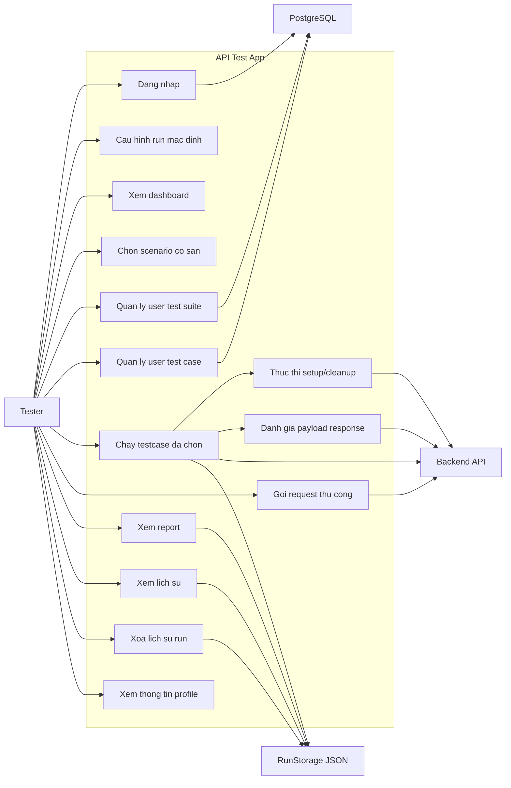

# Use case tong quat

Tai lieu nay mo ta use case tong quat cua `API Test App` dua tren code hien tai trong repo.

Ban phan ra chi tiet hon nam tai [USECASE_PHAN_RA.md](/D:/code/api-test-app/docs/USECASE_PHAN_RA.md).

## 1. Actor

### Nguoi dung chinh

- `Tester`: actor chinh, su dung toan bo workflow chay test API, xem ket qua va quan ly testcase do minh tao.

### He thong ngoai

- `Backend API`: dich vu duoc goi de chay testcase hoac gui request thu cong.
- `PostgreSQL`: noi luu user, role, client machine, user test suite, user test case.
- `RunStorage JSON`: file local luu lich su thuc thi test.

## 2. So do use case

## 3. Danh sach use case

### UC-01: Dang nhap

- Actor: `Tester`
- Muc tieu: vao duoc ung dung voi session hien tai.
- Dau vao: username/email, password, role tren combobox.
- He thong lien quan: `PostgreSQL`

### UC-02: Cau hinh run mac dinh

- Actor: `Tester`
- Muc tieu: dat `Base URL`, `Alert mode`, `Runner` truoc khi chay test.
- Ket qua: gia tri duoc luu trong `AppRunConfig`.

### UC-03: Xem dashboard

- Actor: `Tester`
- Muc tieu: xem tong quan so run, tong testcase, tong pass/fail va cac run gan day.
- He thong lien quan: `RunStorage JSON`

### UC-04: Chon scenario co san

- Actor: `Tester`
- Muc tieu: nap testcase duoc hardcode trong `ApiScenarioRegistry`.
- Dau ra: danh sach testcase, sample request, headers, endpoint.

### UC-05: Quan ly user test suite

- Actor: `Tester`
- Muc tieu: tao, sua, xoa nhom testcase rieng.
- He thong lien quan: `PostgreSQL`

### UC-06: Quan ly user test case

- Actor: `Tester`
- Muc tieu: tao, sua, xoa testcase tu dinh nghia boi nguoi dung.
- He thong lien quan: `PostgreSQL`
- Du lieu chinh: method, endpoint, headers, query params, path params, request body, expected status, setup, cleanup, payload assertions, expected response body.

### UC-07: Chay testcase da chon

- Actor: `Tester`
- Muc tieu: chay `Run All` hoac `Run Selected`.
- He thong lien quan: `Backend API`, `RunStorage JSON`

### UC-08: Thuc thi setup/cleanup

- Actor: `Tester` (kich hoat gian tiep khi run test)
- Muc tieu: tao du lieu phu tro truoc test, capture bien runtime, cleanup sau test.
- He thong lien quan: `Backend API`

### UC-08B: Danh gia payload response

- Actor: `Tester` (kich hoat gian tiep khi run test)
- Muc tieu: so sanh payload theo `jsonPath` hoac so sanh toan bo response JSON.
- He thong lien quan: `Backend API`

### UC-09: Goi request thu cong

- Actor: `Tester`
- Muc tieu: debug nhanh endpoint bang man hinh `Request`.
- He thong lien quan: `Backend API`

### UC-10: Xem report

- Actor: `Tester`
- Muc tieu: xem chi tiet ket qua cua mot lan chay.
- He thong lien quan: `RunStorage JSON`

### UC-11: Xem lich su

- Actor: `Tester`
- Muc tieu: loc va tra cuu cac run da luu.
- He thong lien quan: `RunStorage JSON`

### UC-12: Xoa lich su run

- Actor: `Tester`
- Muc tieu: xoa mot run khoi danh sach lich su.
- He thong lien quan: `RunStorage JSON`

### UC-13: Xem thong tin profile

- Actor: `Tester`
- Muc tieu: xem thong tin nguoi dung hien tai trong man hinh profile.

## 4. Ghi chu pham vi

- Use case tong quat hien tai duoc xay quanh actor `Tester`, vi code chua the hien ro luong nghiep vu rieng cho `Admin`.
- `Environments` va `Collections` co mat trong UI/controller nhung chua thay ro workflow nghiep vu hoan chinh, nen chua tach thanh use case rieng.
- UI auth trong man hinh `Request` da co, nhung hien chua duoc dua vao request thuc te; use case `Goi request thu cong` vi vay moi chi duoc xem la gui request co ban.
- Neu sau nay co phan quyen thuc te, nen tach so do thanh hai actor `Tester` va `Admin`.
