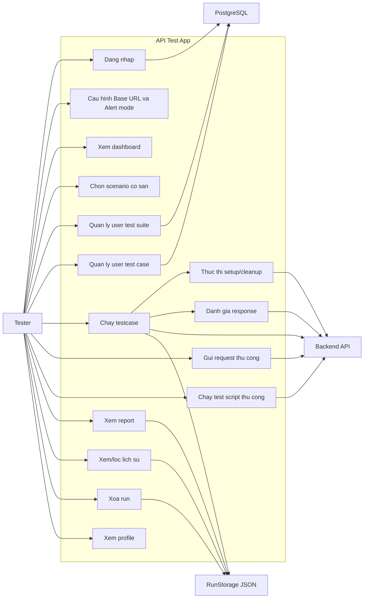

# Use case tong quat

Tai lieu nay mo ta use case muc cao cua `API Test App` dua tren code hien tai.

## 1. Actor

### Actor chinh

- `Tester`: dang nhap, cau hinh base URL, tao/chay testcase, gui request thu cong, xem report va history.

### He thong ngoai

- `Backend API`: dich vu duoc test.
- `PostgreSQL`: luu user, role, client machine, user suite va user testcase.
- `RunStorage JSON`: file local luu lich su run.

## 2. So do use case

## 3. Danh sach use case

### UC-01: Dang nhap

- Actor: `Tester`
- Dau vao: email/username va password.
- Ket qua: `AppSession` co current user, main shell duoc mo.
- He thong lien quan: `PostgreSQL`

### UC-02: Cau hinh Base URL va Alert mode

- Actor: `Tester`
- Dau vao: `Base URL`, `Alert mode`.
- Ket qua: `AppRunConfig` duoc cau hinh; app chuyen sang Testcase.

### UC-03: Xem dashboard

- Actor: `Tester`
- Muc tieu: xem tong quan run/testcase/pass/fail va run gan day.
- He thong lien quan: `RunStorage JSON`

### UC-04: Chon scenario co san

- Actor: `Tester`
- Muc tieu: nap testcase hardcode tu `ApiScenarioRegistry`.
- Dau ra: method, endpoint, sample body, headers va danh sach testcase.

### UC-05: Quan ly user test suite

- Actor: `Tester`
- Muc tieu: tao, sua, soft delete suite va cap nhat cleanup requests.
- He thong lien quan: `PostgreSQL`

### UC-06: Quan ly user test case

- Actor: `Tester`
- Muc tieu: tao, sua, soft delete testcase do user dinh nghia.
- Du lieu: method, endpoint, headers, query params, path params, body, setup, cleanup, payload assertions, expected
  response body, expected status.
- He thong lien quan: `PostgreSQL`

### UC-07: Chay testcase

- Actor: `Tester`
- Muc tieu: chay `Run All` hoac `Run Selected`.
- He thong lien quan: `Backend API`, `RunStorage JSON`

### UC-08: Thuc thi setup/cleanup

- Actor: `Tester` kich hoat gian tiep.
- Muc tieu: tao du lieu truoc test, capture bien response, don dep sau test.
- He thong lien quan: `Backend API`

### UC-09: Danh gia response

- Actor: `Tester` kich hoat gian tiep.
- Muc tieu: so sanh status code, payload assertions theo `jsonPath`, hoac full expected response JSON.

### UC-10: Gui request thu cong

- Actor: `Tester`
- Muc tieu: debug endpoint bang method, URL, params, headers, body va auth.
- He thong lien quan: `Backend API`

### UC-11: Chay test script thu cong

- Actor: `Tester`
- Muc tieu: kiem tra nhanh response bang script assert don gian trong man hinh Request.

### UC-12: Xem report

- Actor: `Tester`
- Muc tieu: xem chi tiet mot run da luu.
- He thong lien quan: `RunStorage JSON`

### UC-13: Xem/loc lich su

- Actor: `Tester`
- Muc tieu: loc run theo ngay, status, keyword va mo report.
- He thong lien quan: `RunStorage JSON`

### UC-14: Xoa run

- Actor: `Tester`
- Muc tieu: xoa mot run khoi lich su local.
- He thong lien quan: `RunStorage JSON`

### UC-15: Xem profile

- Actor: `Tester`
- Muc tieu: xem thong tin user hien tai.

## 4. Ghi chu pham vi

- Chua tach actor `Admin` vi code hien khong co workflow authorization rieng.
- `Collections` va `Environments` chua duoc dua thanh use case chinh.
- Request auth da duoc ap vao header `Authorization`, nhung chua co auth scheme nang cao nhu OAuth flow.
